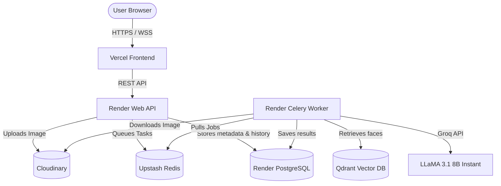

# FaceInsight – Facial Analysis & Skin Health Platform

FaceInsight is an advanced full-stack AI-powered skin health and facial geometry analysis platform. The application captures a user's face, maps facial landmarks, analyzes skin conditions (acne, pores, wrinkles, dark circles), calculates facial symmetry/golden ratio, and generates customized dermatologist-grade skincare recommendations using LLMs.

---

## 🏗️ Architecture & System Design

FaceInsight is architected as a modern microservices application powered by Docker:



- **Frontend**: Flutter Web Application hosted on Vercel utilizing custom graphics, painters, and responsive design systems. Features a custom animated "Created by Dhevesh" watermark.
- **Backend API**: FastAPI asynchronous server hosted as a Render Web Service providing secure/anonymous REST endpoints.
- **Background Workers**: Dedicated Celery worker hosted on a secondary Render account to bypass free-tier memory limits.
- **Storage Layer**: Images are securely stored in Cloudinary, enabling seamless cross-account data sharing between the API and the Worker.
- **ML Pipeline (Optimized for Free Tier)**: 
  - **OpenCV & MediaPipe**: Replaced heavy ML models (like InsightFace) with lightweight OpenCV Haar Cascades for face detection and MediaPipe for facial landmark extraction and geometry calculations. Fits easily within 512MB RAM!
  - **Skin Heuristics**: Heuristic modeling of skin regions for acne detection, dark circles, wrinkles, and pores.
  - **AI Recommendation Engine**: Utilizes LLaMA 3.1 8B via Groq to construct specialized morning and evening routine guides.
- **Database Layer**:
  - **PostgreSQL**: Stores persistent user registration, authentication details, job history, and analysis records.
  - **Redis (Upstash)**: Serverless Redis serving as the message broker connecting the FastAPI server and the Celery worker across different accounts.
  - **Qdrant**: High-performance vector database utilized for facial vector searching and similarity calculations.

---

## ✨ Core Features

1. **Anonymous / Guest Analysis**: Users can upload or capture an image to perform an instant face scan without logging in. The system assigns a guest `job_id` which functions as a secure token to access the results.
2. **Skin Condition Scanner**: Deep scan of key areas detecting **Acne, Wrinkles, Dark Circles, and Pores** with classified severities (Low, Moderate, Good, Excellent).
3. **Facial Structure Metrics**: Extracts geometric landmarks to calculate:
   - **Facial Symmetry Score**: Measure alignment of cheeks, eyes, and jawline.
   - **Golden Ratio (Phi)**: Analyzes proportions of facial landmarks.
   - **Face Shape Recognition**: Identifies face shapes (Oval, Round, Square, Heart, etc.).
   - **Estimated Age & Gender**: Derived heuristically using MediaPipe facial ratios and skin brightness.
4. **AI-Generated Recommendations**: Generates tailored routines (Cleansing, Treatment, Moisturizing, Sun Protection) using structured prompts sent to LLaMA 3.1.
5. **Session-based History**: Authenticated users can save historical analysis jobs, tracking their skin health scores and progress over time.

---

## 🛠️ Technology Stack

| Component | Technology | Description |
|---|---|---|
| **Frontend** | Flutter, Dart | High performance web UI, custom painters, hosted on Vercel |
| **Backend API**| FastAPI, Python 3.11 | High performance async REST framework hosted on Render |
| **Task Queue** | Celery, Upstash Redis | Distributes image analysis tasks asynchronously |
| **Relational DB**| PostgreSQL, SQLAlchemy | Secure metadata and analysis history hosted on Render |
| **Image Storage**| Cloudinary | Remote image storage for cross-service processing |
| **ML Engine** | OpenCV, MediaPipe | Ultra-lightweight face detection, alignment, and landmark mapping |
| **GenAI** | Groq API (LLaMA 3.1 8B) | High speed LLM routine generation |

---

## 🚀 Quick Start Guide

### Setup Environment Variables
Before launching, copy the example environment file and fill in your keys:
```bash
cp .env.example .env
```
Key backend credentials required in `.env`:
* `GROQ_API_KEY`: API key for generating AI recommendations.
* `APP_SECRET_KEY` & `JWT_SECRET_KEY`: Used for authentication.

---

### Option A: Running with Docker Compose (Recommended)
Compile and spin up the entire multi-container architecture in one command:
```bash
docker-compose up --build
```
This launches:
* Postgres database (`localhost:5432`)
* Redis broker (`localhost:6379`)
* Qdrant database (`localhost:6333`)
* Backend API server (`localhost:8000`)
* Celery Workers & Celery Beat Scheduler
* Nginx proxy serving Flutter Web (`localhost:8080`)

---

### Option B: Local Hybrid Development (Faster Iterations)
For developers working on UI tweaks or backend endpoint adjustments, running bare-metal yields the fastest hot-reload cycle.

#### 1. Launch Docker Infrastructure (DB & Cache)
```bash
docker-compose up -d postgres redis qdrant
```

#### 2. Start Python Backend (Terminal 1)
Ensure you have installed the requirements from `backend/requirements.txt`:
```bash
cd backend
pip install -r requirements.txt
python -m uvicorn main:app --host 0.0.0.0 --port 8000 --reload
```

#### 3. Start Celery Worker (Terminal 2)
```bash
cd backend
celery -A workers.tasks worker --loglevel=info
```

#### 4. Run Flutter Web with Hot Reload (Terminal 3)
```bash
cd flutter_app
flutter pub get
flutter run -d chrome --web-port=3000 --web-hostname=localhost
```
* **Hot Reload**: Press `r` in the Flutter terminal to instantly refresh UI.
* **Hot Restart**: Press `R` to reload states.

---

## 🔒 Browser Camera Permissions (Important)
Modern browsers require a **Secure Context** (HTTPS or localhost) to grant camera access. 

* **Testing Locally**: Open `http://localhost:3000` or `http://localhost:8080` in your browser.
* **Testing via IP (e.g. mobile device on LAN)**: If accessing from your phone (e.g. `http://192.168.1.100:8080`), the camera will be blocked. To enable:
  1. Open Chrome on the testing phone.
  2. Navigate to `chrome://flags/#unsafely-treat-insecure-origin-as-secure`.
  3. Enable the flag and enter your computer's IP address (e.g., `http://192.168.1.100:8080`).
  4. Relaunch Chrome.
* **Testing via USB (Port Forwarding)**: Enable **USB Debugging** on your phone, open `chrome://inspect` on your laptop, configure **Port forwarding** (forward port `8080` to `localhost:8080`), and open `http://localhost:8080` directly in your phone's browser.
